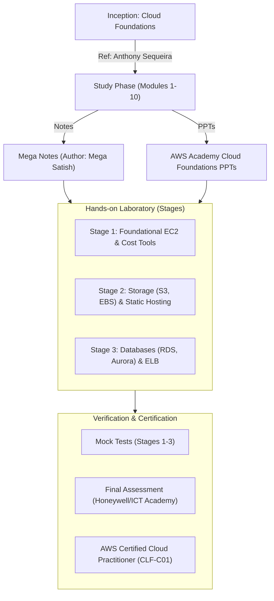

# Technical Specification: AWS Certified Cloud Practitioner (CLF-C01)

## Architectural Overview

The **AWS-CLF-C01** repository is a structured knowledge archive documenting the certification roadmap for the AWS Certified Cloud Practitioner. The system is architected to facilitate a multi-stage learning progression, integrating theoretical foundations (Mega Notes/PPTs) with practical laboratory implementations on the AWS Cloud environment.

### Certification Roadmap & Flow

---

## Technical Implementations

### 1. Lab Workflows: Hands-on Computation & Storage
The repository documents precise procedures for deploying and managing cloud resources:
-   **Compute (EC2)**: Instance creation (Linux/Windows), Key Pair generation, and Elastic IP configuration.
-   **Storage (S3/EBS/EFS)**: Bucket management, static website hosting, volume attachment, and elastic file systems.
-   **Networking (VPC/ELB)**: Virtual Private Cloud configuration and Load Balancer target group management.

### 2. Databases & Transactions
-   **Relational Databases (RDS)**: Deployment of MySQL/Aurora DB instances.
-   **Transactional Logic**: SQL-based transaction scripts located in the `Source Code/` directory for database interaction testing.

---

## Technical Prerequisites

-   **Cloud Environment**: AWS Free Tier environment (IAM, EC2, S3, RDS).
-   **Tooling**: AWS CLI, Putty/SSH Client, Modern Web Browser.
-   **Learning Resources**: AWS Skill Builder & QwikLabs integration as documented in the README.

---

*Technical Specification | Cloud Computing Archive | Version 1.0*
